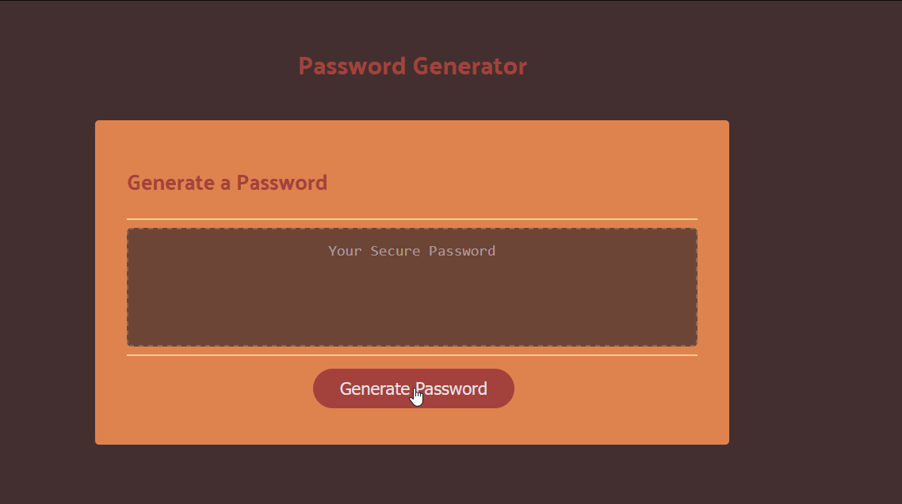

# 03 JavaScript: Password Generator

## Description

This week's project was based around taking some very basic starter code and expanding upon it to create a random password generator utilizing various JavaScript methods we've learned in class over the course of the last few weeks. The program is intended to take user choice into account, asking whether they'd like to include various character types (uppercase, lowercase, numbers and special characters) as well as choosing a length within a predefined range.

The program will then generate a password that fits the criteria.

## Live Website and Preview

[Link to Live Application](https://nihsad.github.io/password-generator/)

